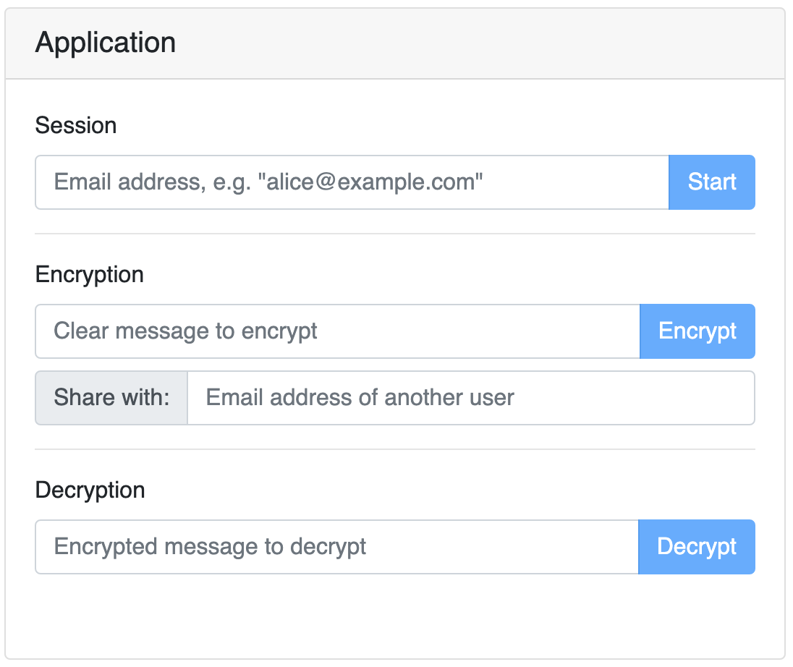
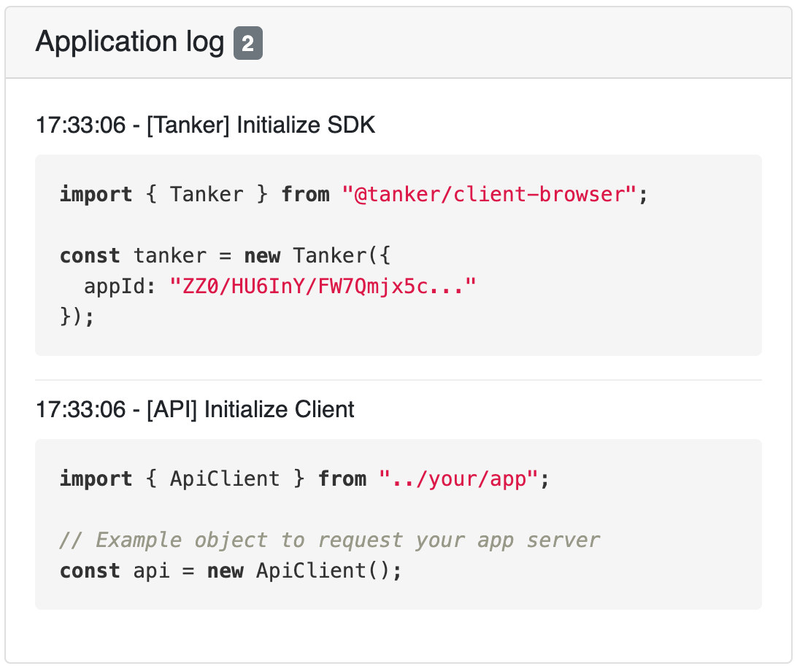

# API Observer example application

## Run the server

Please check that [the server is started](../../../README.md) as this example application will rely on it.

## Run the application

In a new terminal, run:

```bash
yarn start:web:api-observer
```

The application should open in a new browser tab. If not, go to http://127.0.0.1:3000/ manually.

Now you should see something looking like this in your browser:



Each button correspond more or less to a method of the [Tanker API](https://docs.tanker.io/core/latest/api/tanker/).

On the right side of the application (or below if screen is small), there's an application log section you can check to see what's happening behind the hood and how the tanker SDK is being used. It looks like this:



It's time to experiment yourself!

## Play with the application

You'll find below a sequence of actions you can try on the application. In this sequence, you're going to safely share a piece of encrypted data with another user.

### Create users

* Enter a user email address (it can be anything you want). Let's say: `alice_at_example.com`.
* Click on the `Start` button to start a Tanker session.
* Stop the session and create a new user (`bob_at_example.com` for instance), by following the same process.

### Encrypt and Decrypt

In the `Encryption` block:

* Make sure a Tanker session has been started
* Enter a message in the Encryption input
* Click on the `Encrypt` button

The Decryption input should be filled with gibberish:


* You can click on `Decrypt` and `Encrypt` has often as you like. You will note that the same clear text gets encrypted differently every time. This behavior is an expected property of the cryptographic algorithms used by the Tanker SDK.
* Save the encrypted data where you want. It is encrypted and only you can decrypt it.

### Share data

Same as above, but put `alice_at_example.com` in the `share with` block before clicking on the `Encrypt` button.

* Now stop Bob's Tanker session, and re-start a new session for Alice, using her email address.
* Get the encrypted data from the last step (for instance by copy/paste).
* Click on the `Decrypt` button: the clear text should appear in the Encryption input.
