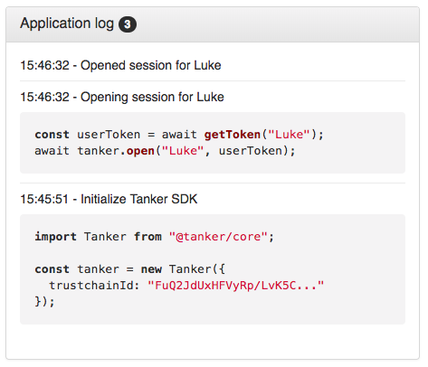

# Code example application

## Run the server

If not done yet, [start the server](../../../README.md) that this example application will need.

## Run the application

In a new terminal, run:

```bash
yarn start:code
```

The application should open in a new browser tab. If not, go to http://localhost:3000/ manually.

Now you should see something looking like this in your browser:


Each button correspond more or less to a method of the [Tanker API](https://tanker.io/docs/latest/api/tanker/).

On the right side of the application (or below if screen is small), there's an application log section you can check to see what's happening behind the hood and how the tanker SDK is being used. It looks like this:



It's time to experiment yourself! Here are the steps required to safely share a piece of data with an other user:

## Play with the application

You'll find below a sequence of actions you can try on the application.

### Create users

* Enter a user ID (it can be anything you want, it just needs to be unique inside a given trustchain). Let's say: `alice-id`)
* Click on the "Open" button to open a Tanker session.
* Close the session and create a new user (`bob-id` for instance), by following the same process.

### Encrypt and Decrypt

In the "Encryption" block

* Make sure a Tanker session has been opened
* Enter a message in the Encryption input
* Click on the "Encrypt" button

The Decryption input should be filled with gibberish:


* You can click on "Decrypt" and "Encrypt" has often as you like. Note that the encrypted text will change every time.
* Save the encrypted data where you want. It is encrypted and only you can decrypt it.

### Share data

Same as above, but put 'alice-id' in the `share with` block before clicking on the "Encrypt" button.

* Now close Bob's Tanker session, and re-open a new session for Alice, using her id.
* Get the encrypted data from the last step (for instance by copy/paste, or using an instant messaging service).
* Click on the "Decrypt" button: the clear text should appear in the Encryption input.
